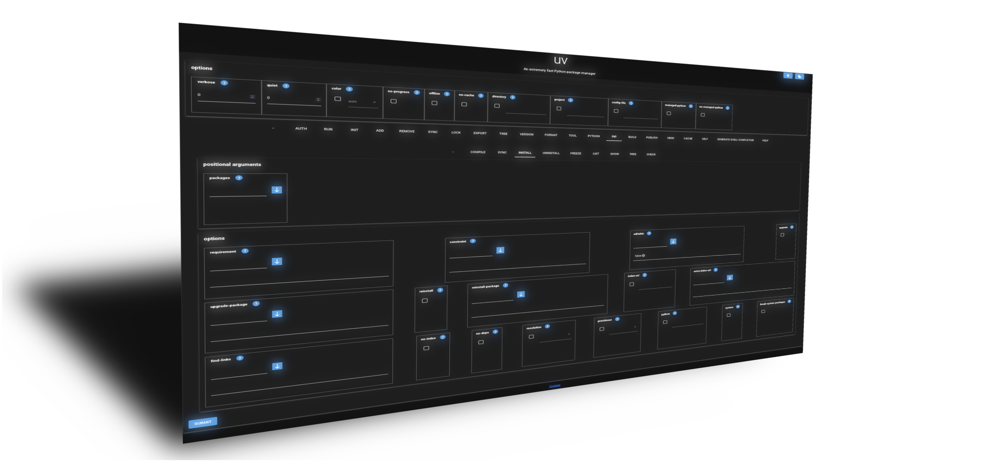
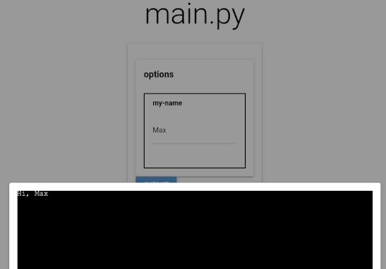
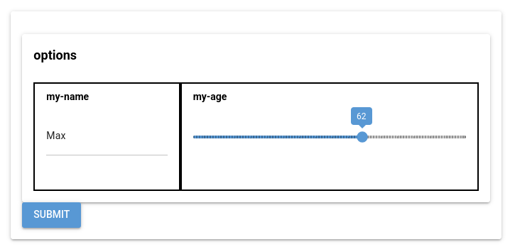

# NiceGooey
Turn your Python CLI program into a modern web-based UI



Based on [Gooey](https://github.com/chriskiehl/Gooey) and created using [nicegui](https://github.com/zauberzeug/nicegui),
NiceGooey transforms your CLI tool written with Python's [argparse](https://docs.python.org/3/library/argparse.html) into
a modern web UI with just a single line of code.

# Minimal example

Just importing and adding the annotation `@nice_gooey_argparse_main(patch_argparse=True)` to your main function is
enough to start using NiceGooey.

```python
from nicegooey.argparse import nice_gooey_argparse_main
import argparse

@nice_gooey_argparse_main(patch_argparse=True)
def main():
    parser = argparse.ArgumentParser()
    parser.add_argument("--my-name", type=str, required=True)
    namespace = parser.parse_args()
    print(f"Hi, {namespace.my_name}")
```

Without using NiceGooey, this is a simple command line tool for which the call `tool --my-name=Max` would print `Hi, Max` to the terminal.
With NiceGooey, this renders a web page with a text input and a submit button that shows `"Hi, Max"` in your browser.



# More control by using NgArgumentParser

If the simple one-liner patch is not enough for you, a more type-safe and configurable version of NiceGooey
can be used by using the `NgArgumentParser` class instead of `argparse.ArgumentParser`.
See below for more info about `nicegooey_config`.

```python
from nicegooey.argparse import nice_gooey_argparse_main, NgArgumentParser, NiceGooeyConfig
from nicegooey.argparse.ui_classes.actions.action_alternatives import store_action_slider


@nice_gooey_argparse_main(patch_argparse=False)
def main1(*args, **kwargs):
    parser = NgArgumentParser()
    my_name_action = parser.add_argument("--my-name", type=str, required=True)
    my_age_action = parser.add_argument("--my-age", type=int, required=True)
    parser.nicegooey_config = NiceGooeyConfig(
        root_card_class="max-w-4xl",  # don't take up the entire screen on wide desktops
        action_element_overrides={
            # Display the age as a slider instead of a number field.
            my_age_action: store_action_slider(min=0, max=100, step=1)
        }
    )
    namespace = parser.parse_args()
    print(f"Hi, {namespace.my_name}")

```



# Configuring your application

By setting the `nicegooey_config` field of an `NgArgumentParser` instance, you can configure the style and behavior of your page.
The `NiceGooeyConfig` class offers the following options:

**root_card_class** <br>
A string of space-separated Tailwind classes that are applied to the top-level card widget.
Most useful for specifying a certain size with "w-[size]" or "max-w-[size]".

**action_element_overrides** <br>
A dict that maps action objects (which are created and returned by `add_argument`) to special widget classes to render them.
The module `nicegooey.argparse.ui_classes.actions.action_alternatives` contains pre-defined alternatives to existing standards,
like a slider with minimum and maximum limits instead of a free-form number input. <br>
If you are interested in writing your own class, consider looking at the `action_alternatives` for a starting point.

# License

NiceGooey is published under [LGPL](LICENSE).
You are almost certainly allowed to use it for whatever your use case is, but are required to publish a copy of LGPL with it.
This is covered by NiceGooey already, which shows a "License" button at the bottom of the page.

# Artificial Intelligence

Generative AI and coding agents being a hot topic at the moment, especially in Open Source projects, this section is about disclosing any use of AI within this project, for anyone who is intersted:

- There is no AI of any kind being called from the NiceGooey code itself.
- Anthropic's Claude chat was used when planning ideas, implementations, and troubleshooting of the implementation.
- Anthropic's Claude Code was used occasionally to write unit tests and perform refactorings on the implementation.
